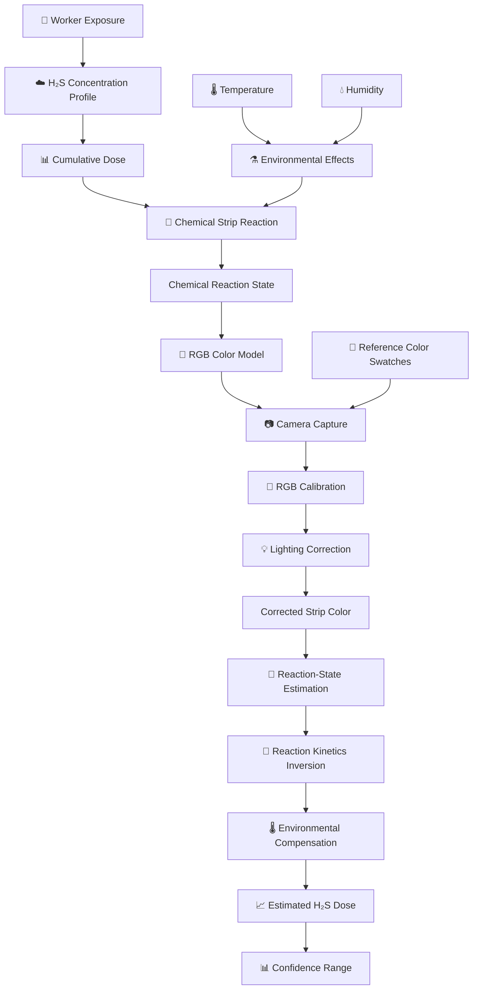
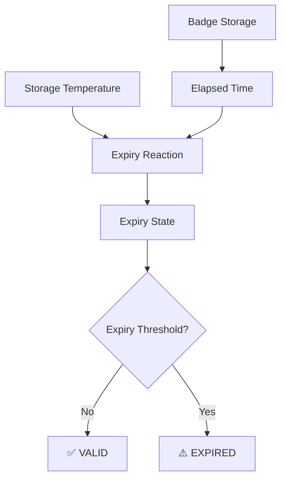
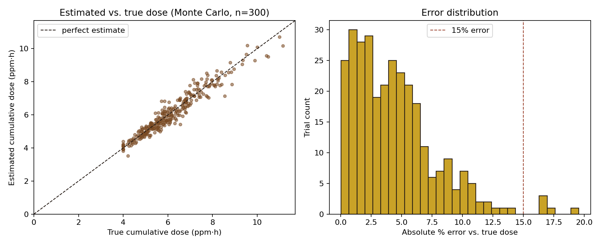

# 🧪 SANKET: Digital Passive H₂S Exposure Dosimeter

> **A Low-Cost Passive Approach for Estimating Cumulative Occupational H₂S Exposure**

---

## 🌍 Overview

Hydrogen sulfide (H₂S) is a hazardous gas encountered in oil and gas operations, where workers can experience both short-duration exposure peaks and prolonged low-level exposure.

Conventional electronic gas detectors primarily provide instantaneous concentration measurements and require batteries, calibration, and regular maintenance. Passive colorimetric badges provide a simpler alternative, but their color response is generally interpreted visually and does not directly provide a numerical cumulative exposure value.

**SANKET** proposes a digitally readable passive H₂S exposure dosimeter based on a progressively responding colorimetric strip.

The proposed system combines:

- 🧪 A passive H₂S-sensitive chemical strip
- 🎨 A printed reference color scale
- ⏳ A separate badge expiry indicator
- 📷 Smartphone-based image capture
- 🔧 Reference-based lighting correction
- 🧮 Cumulative dose estimation in **ppm·h**
- 🌡️ Temperature and humidity compensation
- 📊 Uncertainty-aware dose reporting

The current repository implements the **computational prototype** of this concept, including exposure simulation, chemical reaction modelling, color calibration, camera/lighting simulation, dose estimation, uncertainty estimation, and Monte Carlo validation.

---

## 🚨 Problem

Workers in oil and gas operations can be exposed to hydrogen sulfide over extended periods.

Traditional electronic gas detectors are essential for detecting instantaneous H₂S concentrations and peak exposures, but they require batteries, calibration, and maintenance.

Existing passive colorimetric badges can provide a visual indication of exposure, but visual interpretation has several limitations:

- ❌ No direct numerical cumulative-dose reading
- ❌ Manual interpretation of color
- ❌ Lighting conditions can change apparent color
- ❌ Difficult to maintain digital exposure history
- ❌ Limited information about cumulative concentration × time exposure
- ❌ Badge ageing and expiry may not be immediately apparent

The central problem addressed by SANKET is:

> **How can a low-cost passive H₂S badge be digitally interpreted to estimate cumulative occupational exposure rather than providing only a visual indication?**

📄 **[View SIH Problem Statement](./Problem)**

---

## 💡 Proposed Solution

SANKET proposes a disposable passive H₂S exposure badge/wristband containing three main elements.

### 🧪 1. H₂S Exposure Strip

A chemical sensing strip is designed to progressively change color with cumulative H₂S exposure.

Instead of providing only:

```text
EXPOSED / NOT EXPOSED
```

the intended concept is:

```text
Low Exposure
     ↓
Moderate Exposure
     ↓
Higher Exposure
     ↓
Increasing Reaction / Saturation
```

---

### 🎨 2. Reference Color Scale

Known reference color patches are placed beside the sensing strip.

The reference colors allow the camera-based system to estimate lighting and color distortion when the badge is photographed.

```text
Known Reference Colors
          +
Photographed Reference Colors
          ↓
Lighting Estimation
          ↓
Color Correction
          ↓
Corrected Strip Color
```

---

### ⏳ 3. Expiry Indicator

A separate patch is intended to indicate whether the badge is still within its usable shelf life.

The expiry mechanism is independent of the H₂S exposure strip.

```text
Storage Time
      +
Storage Temperature
      ↓
Expiry Indicator
      ↓
VALID / EXPIRED
```

---

### 📱 4. Digital Reading

The proposed smartphone application captures the sensing strip together with the reference color scale.

The computational pipeline then:

```text
Badge Photograph
       ↓
Reference Color Calibration
       ↓
Lighting Correction
       ↓
Strip Color Estimation
       ↓
Reaction-State Estimation
       ↓
Dose Estimation
       ↓
Environmental Compensation
       ↓
Estimated Cumulative H₂S Dose
       ↓
Confidence Range
```

📄 **[View Proposed Solution](./Proposed%20Solution)**

---

## 🚀 Key Features

- **Cumulative Exposure Estimation:** Estimates cumulative H₂S exposure in **ppm·h**.
- **Progressive Color Response:** Models a continuous chemical response rather than a simple binary threshold.
- **Reference-Based Calibration:** Uses known reference colors to compensate for photograph-related lighting distortion.
- **Environmental Compensation:** Incorporates temperature and relative humidity into the reaction model.
- **Camera Distortion Simulation:** Simulates lighting variation, exposure changes, channel-wise distortion, and sensor noise.
- **Digital Color Interpretation:** Converts corrected RGB color into an estimated chemical reaction state.
- **Dose Estimation:** Inverts the chemical response model to estimate cumulative exposure.
- **Uncertainty Estimation:** Provides an estimated dose together with a confidence range.
- **Expiry Modelling:** Includes an independent computational model for badge shelf life.
- **Monte Carlo Validation:** Tests the complete computational pipeline across randomized conditions.
- **Modular Architecture:** Separates environmental simulation, reaction kinetics, color processing, camera modelling, dose estimation, and validation.

---

## ⚙️ Software Stack

### Programming

- 🐍 **Python**

### Numerical Computing

- 🔢 **NumPy**

### Visualization

- 📊 **Matplotlib**

### Computational Methods

- Numerical integration
- Reaction kinetics modelling
- RGB color interpolation
- RGB calibration
- Least-squares correction
- Camera distortion simulation
- Monte Carlo simulation
- Bootstrap-based uncertainty estimation

---

## 🧩 Software Modules

### 1. 🌡️ Environment Simulation

**File:** `environment.py`

Simulates an occupational worker shift containing:

- H₂S concentration profile
- Low-level baseline exposure
- Short-duration exposure spikes
- Temperature variation
- Relative humidity variation
- Ground-truth cumulative exposure

The current simulation models an **8-hour shift** using a **1-minute time step**.

---

### 2. 🧪 Reaction Kinetics

**File:** `reaction_kinetics.py`

Models the computational response of the proposed chemical sensing strip.

The strip response is represented using a saturating relationship:

```text
f = 1 - exp(-k_eff × D)
```

where:

- `f` = fraction of chemical reaction completed
- `D` = cumulative exposure
- `k_eff` = effective reaction rate

Temperature and humidity are incorporated into the effective reaction behaviour.

This module also contains the computational model for the separate expiry indicator.

---

### 3. 🎨 Color Model

**File:** `color_model.py`

Converts the simulated chemical reaction state into an RGB color.

The current computational calibration represents a progression approximately from:

```text
Pale / Cream
      ↓
    Ochre
      ↓
    Umber
      ↓
  Near Black
```

The model supports both:

```text
Reaction State → RGB Color
```

and:

```text
RGB Color → Estimated Reaction State
```

The current RGB values represent a **computational calibration model** and require experimental calibration using a physical sensing strip in future development.

---

### 4. 📷 Camera Model

**File:** `camera_model.py`

Simulates changes that can occur when the badge is photographed.

The model includes:

- Per-channel gain variation
- Per-channel offset
- Warm/cool lighting variation
- Exposure variation
- Sensor noise

The strip and reference colors are subjected to the same simulated lighting transformation because they are assumed to be captured within the same photograph.

---

### 5. 🧮 Dose Estimator

**File:** `dose_estimator.py`

Performs the computational dose-estimation pipeline.

```text
Photographed Reference Swatches
             +
Photographed Strip
             ↓
RGB Calibration
             ↓
Lighting Transformation Estimation
             ↓
Strip Color Correction
             ↓
Reaction-State Estimation
             ↓
Reaction Kinetics Inversion
             ↓
Temperature / Humidity Compensation
             ↓
Estimated Cumulative Dose
             ↓
Confidence Range
```

The estimator produces:

- Estimated cumulative dose
- Lower confidence bound
- Upper confidence bound
- Color matching residual

---

### 6. 📊 End-to-End Validation

**File:** `main_simulation.py`

Connects all computational modules and performs the complete validation pipeline.

The validation process introduces randomized variations in:

- H₂S exposure
- Exposure spikes
- Temperature
- Humidity
- Lighting
- Camera noise

The current validation framework runs **300 Monte Carlo trials**.

---

## 🔄 Prototype Workflow

```text
1. Generate simulated worker shift
                 ↓
2. Generate H₂S concentration profile
                 ↓
3. Calculate ground-truth cumulative dose
                 ↓
4. Simulate chemical-strip response
                 ↓
5. Convert reaction state to RGB
                 ↓
6. Generate reference color swatches
                 ↓
7. Simulate smartphone photograph
                 ↓
8. Apply lighting and camera distortion
                 ↓
9. Calibrate using reference swatches
                 ↓
10. Correct strip color
                 ↓
11. Estimate reaction state
                 ↓
12. Invert reaction kinetics
                 ↓
13. Apply environmental compensation
                 ↓
14. Estimate cumulative H₂S dose
                 ↓
15. Calculate uncertainty range
                 ↓
16. Compare estimated dose with ground truth
```

---

## 🧭 System Architecture



---

## 🧮 Mathematical Model

### Cumulative Exposure

The fundamental measurement quantity in SANKET is cumulative H₂S exposure.

```text
D = ∫ C(t) dt
```

where:

```text
D  = cumulative dose in ppm·h
C(t) = H₂S concentration in ppm
t  = exposure time
```

This allows the system to represent exposure accumulated over time instead of considering only instantaneous concentration.

---

### Chemical Response

The chemical strip is represented using a saturating response model:

```text
f = 1 - exp(-k_eff × D)
```

where:

```text
f      = fraction of reaction completed
D      = cumulative exposure
k_eff  = effective reaction rate
```

The saturation behaviour is important because a chemical color response should not be assumed to remain perfectly linear for unlimited exposure.

---

## 🌡️ Environmental Effects

Temperature and relative humidity can influence chemical reaction rates.

The computational model therefore includes both factors.

```text
             H₂S Exposure
                  │
                  ▼
        ┌──────────────────┐
        │ Reaction Kinetics│
        └────────┬─────────┘
                 ▲
          ┌──────┴──────┐
          │             │
     Temperature     Humidity
          │             │
          └──────┬──────┘
                 ↓
        Effective Reaction
```

Temperature sensitivity is represented using a Q10-style relationship, while humidity is incorporated through a reaction-rate multiplier.

---

## 📷 Camera Calibration

A major challenge in camera-based color measurement is that the observed RGB value depends on lighting and camera characteristics.

SANKET addresses this using reference color swatches.

```text
Known Reference Colors
          +
Photographed Reference Colors
          ↓
Estimate Color Transformation
          ↓
Inverse Transformation
          ↓
Correct Photographed Strip
```

The computational camera model represents the transformation approximately as:

```text
Photographed Color = a × True Color + b
```

The correction then estimates:

```text
Corrected Color = (Photographed Color - b) / a
```

This provides a computational approximation of the strip's original color under reference conditions.

---

## 🎨 Color Processing

The color-processing pipeline is:

```text
Chemical Reaction State
          ↓
Calibration Curve
          ↓
RGB Color
          ↓
Camera / Lighting Distortion
          ↓
Photographed RGB
          ↓
Reference-Based Correction
          ↓
Corrected RGB
          ↓
Closest Calibration State
          ↓
Estimated Reaction Fraction
```

The inverse color model searches the calibration curve for the closest RGB state.

---

## ⏳ Expiry / Shelf-Life Model

The proposed badge contains a separate expiry indicator.

The expiry indicator is modelled independently from the H₂S sensing strip.



The current computational model supports configurable shelf-life targets including:

- **30 days**
- **90 days**

The simulation also evaluates elevated storage temperature to represent accelerated ageing behaviour.

---

## 🧪 End-to-End Computational Pipeline

All major modules are connected through the main validation script.


This structure allows individual components to be modified and evaluated independently.

---

## 📊 Monte Carlo Validation

The current validation framework performs:

```text
300 randomized simulation trials
```

Each trial introduces variations in:

- H₂S concentration
- Exposure spikes
- Temperature
- Humidity
- Lighting conditions
- Camera noise

The estimated cumulative dose is then compared against the simulated ground-truth dose.

---

## 📈 Validation Metrics

The validation pipeline calculates:

| Metric | Purpose |
|---|---|
| **MAE** | Mean Absolute Error between estimated and true dose |
| **RMSE** | Root Mean Square Error |
| **Median % Error** | Typical relative estimation error |
| **Within 15%** | Percentage of trials with ≤15% estimation error |
| **Within 25%** | Percentage of trials with ≤25% estimation error |
| **Confidence Coverage** | Percentage of true doses contained within the estimated confidence interval |

These metrics allow the computational pipeline to be evaluated under different simulated exposure and imaging conditions.

---

## 📉 Validation Output

The current simulation generates:

```text
outputs/dose_validation.png
```

The generated figure contains:

### Estimated vs True Dose

```text
Ground-Truth Cumulative Dose
             vs.
Estimated Cumulative Dose
```

### Error Distribution

```text
Absolute Percentage Error
             vs.
Number of Trials
```

The output can be viewed directly below:



> **Note:** These results represent computational simulation performance and do not represent laboratory accuracy of a physical H₂S sensing strip.

---

## 🧪 Shelf-Life Validation

The computational expiry model evaluates different target shelf-life specifications.

Current target variants include:

```text
30-day shelf life
90-day shelf life
```

The model also evaluates elevated storage temperature to examine accelerated ageing behaviour.

The purpose is to explore whether the computational expiry indicator can distinguish:

```text
VALID BADGE
     vs.
EXPIRED BADGE
```

before physical prototype testing.

---

## 📂 Project Structure

```text
SANKET/
│
├── README.md
│
├── Problem
│
├── Proposed Solution
│
├── simulation/
│   ├── camera_model.py
│   ├── color_model.py
│   ├── dose_estimator.py
│   ├── environment.py
│   ├── main_simulation.py
│   └── reaction_kinetics.py
│
├── outputs/
│   └── dose_validation.png
│
├── requirements.txt
│
├── .gitignore
│
└── LICENSE
```

---

## 🛠️ Module Overview

| Module | File | Function |
|---|---|---|
| 🌡️ Environment | `environment.py` | H₂S, temperature and humidity simulation |
| 🧪 Reaction Kinetics | `reaction_kinetics.py` | Chemical-strip and expiry modelling |
| 🎨 Color Model | `color_model.py` | Reaction state ↔ RGB conversion |
| 📷 Camera Model | `camera_model.py` | Lighting and camera distortion |
| 🧮 Dose Estimator | `dose_estimator.py` | Color calibration and dose estimation |
| 📊 Validation | `main_simulation.py` | Monte Carlo and end-to-end validation |

---

## 💻 Installation

### Clone the Repository

```bash
git clone https://github.com/YOUR_USERNAME/SANKET.git
cd SANKET
```

Replace `YOUR_USERNAME` with your GitHub username.

---

### Create Virtual Environment

#### Windows

```bash
python -m venv venv
venv\Scripts\activate
```

#### Linux / macOS

```bash
python3 -m venv venv
source venv/bin/activate
```

---

### Install Dependencies

```bash
pip install -r requirements.txt
```

---

## ▶️ Running the Project

Run the complete computational simulation:

```bash
python simulation/main_simulation.py
```

The program performs:

```text
Environment Generation
        ↓
H₂S Exposure Simulation
        ↓
Cumulative Dose Calculation
        ↓
Chemical Reaction Simulation
        ↓
Color Generation
        ↓
Camera Simulation
        ↓
Reference Calibration
        ↓
Color Correction
        ↓
Dose Estimation
        ↓
Uncertainty Estimation
        ↓
Monte Carlo Validation
        ↓
Expiry Validation
        ↓
Output Plot
```

---

## 📋 Expected Output

The validation script reports metrics including:

```text
Mean Absolute Error
RMSE
Median Percentage Error
Percentage Within 15%
Percentage Within 25%
Confidence Interval Coverage
```

The script also performs expiry/shelf-life validation.

The exact numerical results should be obtained by running the current version of the simulation.

---

## 🔬 Current Implementation Status

### Computational Prototype

- [x] H₂S exposure simulation
- [x] 8-hour worker shift model
- [x] Low-level baseline exposure
- [x] Random exposure spikes
- [x] Cumulative dose calculation
- [x] Temperature modelling
- [x] Humidity modelling
- [x] Chemical reaction kinetics
- [x] Saturating response model
- [x] RGB color calibration
- [x] Reference color swatches
- [x] Camera/lighting simulation
- [x] Camera sensor noise simulation
- [x] Reference-based lighting correction
- [x] Reaction-state estimation
- [x] Reaction-kinetics inversion
- [x] Environmental compensation
- [x] Cumulative dose estimation
- [x] Confidence-range estimation
- [x] Monte Carlo validation
- [x] Expiry indicator model
- [x] Shelf-life simulation

---

## 🧪 Physical Prototype — Next Development Stage

The following stages require physical development and experimental validation:

- [ ] H₂S-sensitive chemical formulation
- [ ] Physical sensing strip fabrication
- [ ] Disposable wristband/badge
- [ ] Physical reference color scale
- [ ] Physical expiry indicator
- [ ] Controlled H₂S exposure experiments
- [ ] Experimental dose-response calibration
- [ ] Real smartphone camera testing
- [ ] Physical temperature/humidity characterization
- [ ] Experimental shelf-life validation
- [ ] Field testing

---

## 🛣️ Development Roadmap


### Phase 1 — Computational Modelling

Develop and validate:

- H₂S exposure model
- Reaction kinetics
- Color model
- Camera model
- Lighting correction
- Dose estimator
- Uncertainty estimation

### Phase 2 — Chemical Prototype

Develop and characterize the actual H₂S-sensitive chemical strip.

### Phase 3 — Controlled Testing

Expose the physical strip to known combinations of:

```text
H₂S Concentration × Exposure Duration
```

and establish an experimental dose-response relationship.

### Phase 4 — Smartphone Application

Develop the mobile reading application:

```text
Capture Badge
      ↓
Detect Strip + Reference Scale
      ↓
Lighting Correction
      ↓
Color Analysis
      ↓
Dose Estimation
      ↓
Exposure Record
```

### Phase 5 — Physical Validation

Evaluate:

- H₂S response
- Temperature effects
- Humidity effects
- Camera variation
- Repeatability
- Shelf life

### Phase 6 — Field Evaluation

Evaluate the integrated system under representative occupational conditions after appropriate laboratory validation.

---

## 🧠 Technical Highlights

| Challenge | SANKET Approach |
|---|---|
| Instantaneous readings do not represent cumulative exposure | Cumulative ppm·h modelling |
| Chemical response can saturate | Saturating reaction kinetics |
| Color changes with lighting | Reference-color calibration |
| Temperature affects reaction rate | Temperature-dependent model |
| Humidity affects reaction rate | Humidity compensation |
| Manual color interpretation | Digital RGB analysis |
| Badge ageing | Independent expiry model |
| Estimation uncertainty | Confidence-range calculation |
| Variable exposure conditions | Monte Carlo simulation |

---

## 🎯 Problem → Solution Mapping

| Problem | SANKET Approach |
|---|---|
| Focus on instantaneous H₂S concentration | Estimate cumulative exposure in ppm·h |
| Manual visual color interpretation | Camera-based color analysis |
| Lighting changes apparent color | Reference-swatch calibration |
| Environmental conditions affect chemistry | Temperature/humidity compensation |
| No direct numerical cumulative dose | Computational dose estimation |
| Badge ageing/expiry | Separate expiry indicator model |
| Difficult digital exposure tracking | Future worker/shift logging |

---

## 🌟 Innovation

The central concept of SANKET is the combination of:

```text
Passive Chemical Sensing
          +
Printed Reference Colors
          +
Camera-Based Reading
          +
Computational Calibration
          +
Cumulative Dose Estimation
```

The system aims to transform a passive visual sensing concept into a digitally interpretable exposure measurement.

Instead of:

```text
Color Change
     ↓
Human Interpretation
```

SANKET proposes:

```text
Color Change
     ↓
Reference-Calibrated Image
     ↓
Digital Color Analysis
     ↓
Chemical State Estimation
     ↓
Cumulative Dose
     ↓
Uncertainty Range
```

---

## 🏭 Potential Applications

The proposed concept can be explored for environments where occupational H₂S exposure is a concern, including:

- 🛢️ Oil and gas operations
- 🏭 Refineries
- ⚗️ Petrochemical facilities
- 🔧 Industrial maintenance
- 🏗️ Industrial work environments
- 🚧 Confined-work environments where H₂S exposure may occur

SANKET is intended as a potential **supplementary cumulative-exposure monitoring approach**, not as a replacement for certified peak-exposure alarms or mandatory industrial safety systems.

---
